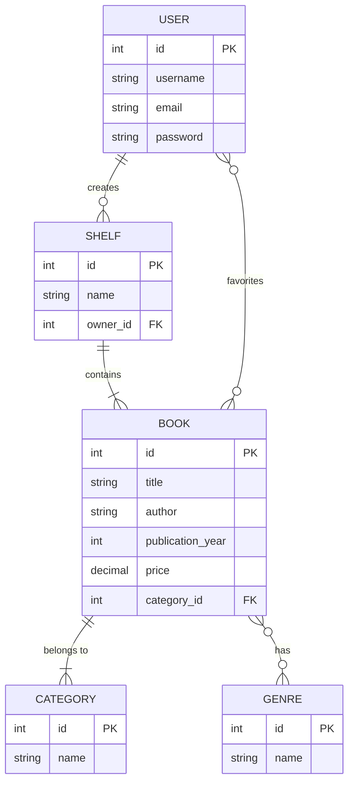

```mermaid
erDiagram
    USER ||--o{ SHELF : "creates"
    SHELF ||--|{ BOOK : "contains"
    BOOK ||--|{ CATEGORY : "belongs to"
    BOOK }o--o{ GENRE : "has"
    USER }o--o{ BOOK : "favorites"

    USER {
        int id PK
        string username
        string email
        string password
    }

    SHELF {
        int id PK
        string name
        int owner_id FK
    }

    BOOK {
        int id PK
        string title
        string author
        int publication_year
        decimal price
        int category_id FK
    }

    CATEGORY {
        int id PK
        string name
    }

    GENRE {
        int id PK
        string name
    }
```